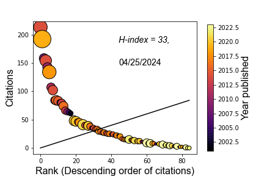

# PubPy
## Academic Metrics Visualization

### Metrics
*Metrics.* It's not a word we academics like to hear, but we are evaluated on metrics. We are evaluated by other academics in different fields as well as by the "suits" that have infiltrated the academy. They obviously cannot dig as deeply into scholarly output that is outside of our field. So publication metrics are likely a necessary evil that is here to stay. 

Given their staying power, there is value in understanding your own publication metrics better than your evaluators. Understanding the evolution of metrics like the Hirsch, or h, index can help you prioritize the types of projects where you spend your time in order to make sure that your scholarly output is deemed impressive by your evaluators. This toolkit enables you to visualize your publication metrics in several ways based on manual data snapshots that you take from [Google scholar](www.scholar.google.com) 

### Hirsch Plots
The infamous h-index is based on the Hirsch plot, a plot of your publications' citations on their rankings by number of citations (in descending order, where 1 is your most highly cited publication and n is your lowest). 

**Figure 1** *Hirsch plot from Brad Rosenheim, google scholar data taken on January 17, 2022. The h-index is the number at which the black line (1:1 ratio) intersects with the ranked publication citations plot, or the number at which the number of papers with more citations is equal to it. The color of the data bubbles corresponds to the color bar, year of publication, and the size of the bubbles is relative to the number of citations per year for each publication. The larger the bubble, the more it gets cited per year.*

This package plots the Hirsch plot that allows to understand which papers are "hot," *i.e.* which papers will soon contribute to your h-index by rocketing up the curve with high citations per year, and which ones may be sleepers. Obviously, this differentiation may not correspond at all to the papers' importance to your field, but it provides a discussion point of such papers that can enrich the discussion of your metrics beyond a simple number. 

### Hirsch Plot Evolution
It is good to see how your h-index has changed through time. This can be done with a simple time series of your data snapshots, which I encourage you to compare to an h-index calculator. Additionally, you can construct paneled plots of your detailed Hirsch bubble plots to show how your h-index is involving. Is it involving simply because you are publishing more papers and citing yourself, or is it because your papers have started to have a large impact on your field indicated by heavy citations? Or is it both? One thing is certain: *You cannot change your h-index without publishing!*

**Figure 2** *Evolution of Hirsch plots from Brad Rosenheim, google scholar data taken periodically between 2013 and 2023. The data are displayed in the same way as in **Figure 1**, however there is only one colorbar and its range is shared by all 4 subplots.*

**Figure 3** *Evolution of h-index values from Brad Rosenheim, google scholar data taken periodically between 2013 and 2023. This plots the h-index calculated from the bubble plots above and plots them on date. There is an option for a prediction and I used the calculator based on an article by [Acuna, Allesina, and Kording (2012)](https://www.nature.com/articles/489201a#Sec1) in Nature. This article no longer links to the calculation, though, so in place you can make your own goals and include them in the same format as my prediction calculation.*

### Using this Toolbox
There is a template that called `Demo_Notebook.py`. This is designed to be accessed either through your favorite Python workspace or as a Jupyter notebook using `Jupytext`. I recommend using it as a Jupyter notebook with Jupytext. I recommend the following steps: 
1. You should work through this notebook which is based on google scholar shapshots from my profile between 2013 and 2022. 
2. You should create your own spreadsheet based off of `H_Index_Rosenheim_Demo.xlsx` by replacing my data with yours. Currently this needs to be done manually. 
3. Save a copy of the Demo Jupyter Notebook with a new file name and change the file name to direct it at your google scholar snapshot data. Make a tab for each snapshot at whichever frequency you think it is important. 
4. After a few years, you will be ready to discuss your H-Index evolution with even the most metric-concerned administrator. 

